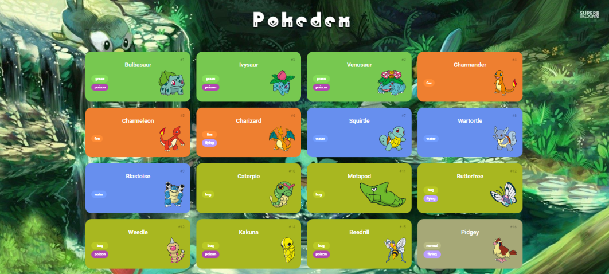

# Trilha JS Developer - Pokedex
    Santander Bootcamp 2023 - Fullstack Java+Angular

## Ferramentas utilizadas:
- [HTML](https://www.w3schools.com/html/)
- [CSS](https://www.w3schools.com/Css/)
- [JavaScript](https://developer.mozilla.org/en-US/docs/Web/JavaScript/Guide/Introduction)
- [PokeAPI](https://pokeapi.co/?ref=public-apis)

## Projeto: 
 

